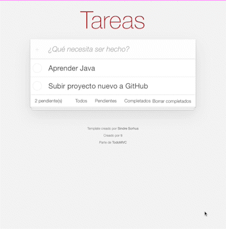

# 📝 ToDo App 📝

Con ToDoApp podras crear listas de tareas o incluso recordatorios, que podras marcar como completados cuando ya realices esa tarea o si gustas podras eliminarlo de la lista para solo dejar los que te falten.

Pruebalo tu mismo! [ToDoApp](https://todoapp-vite.netlify.app) 🚀

### Demo de la App 🗒



#### Instalacion

Pasos para ejecutar proyecto:

1. Clonar repositorio
2. Ejecutar ```npm install``` para reconstruir los módulos de node
3. Correr el devServer ```npm run dev```

#### Producción

1. Ejecutar ```npm run build```
2. Tomar la carpeta ```dist``` y desplegarla